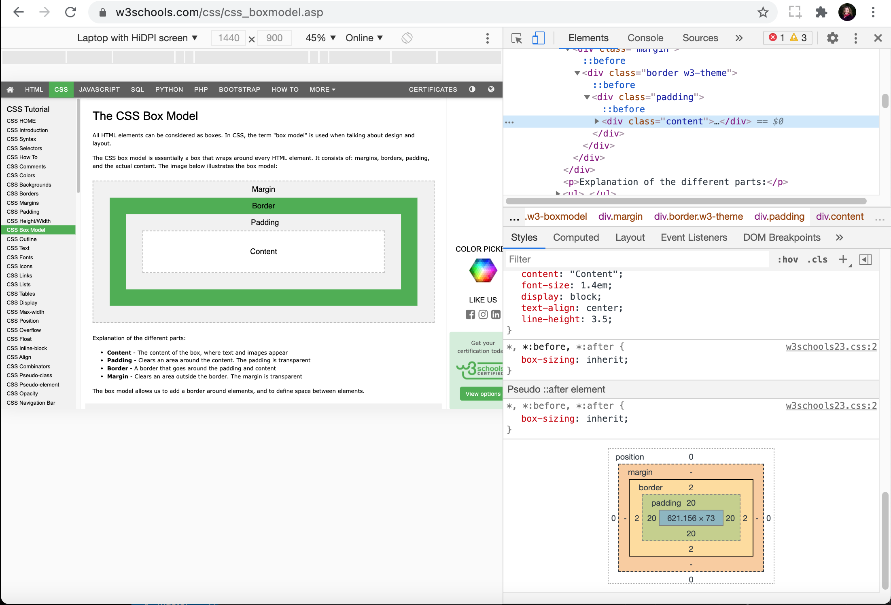

<h1 class="capitalize">COMD2451</h1>
<h2 class="capitalize center">The CSS Box Model and Document Flow</h2>

---

<section class="section">
    <h2 class="sentence">The CSS Box Model: What is It?</h2>
    
The `CSS Box Model` is ***basically*** a `box` that `wraps around` ***every*** `HTML element`. It ***consists*** of `margins`, `borders`, `padding`, ***and actual*** `content`. 

The `CSS Box Model` ***consists*** of:

+ `Content`
+ `Padding`
+ `Border`
+ `Margin`
+ `Position` (in `Chrome Developer Tools` ***via*** the `Elements Tab` and then ***within*** the `html` ***or*** the `body tab` ***under*** `styles`. Have ***not*** been able to ***find out*** `anywhere` ***yet*** what `position` ***represents***. It has ***not*** been there in ***previous versions*** of `Chrome DevTools` as far as I ***know***)

A ***visual*** `example` can be ***found*** on `w3schools`:
[The CSS Box Model](https://www.w3schools.com/css/css_boxmodel.asp).

The `CSS Box Model` ***also appears*** in `Chrome Developer Tools` when we ***visit*** the `Elements tab` to ***view*** our ***live*** `HTML markup`:

<div>
    
</div>

</section>

---

<section class="section">
    <h2 class="sentence">The CSS Box Model breakdown: the Content</h2>
    
`Content`: in the `screen shot` in the `slide` ***entitled*** `The CSS Box Model: What is It?`, the `Content` ***represents*** the `content` of the `box`, ***where*** `text` and `images` ***appear***, for ***example***.

</section>

---

<section class="section">
    <h2 class="sentence">The CSS Box Model breakdown: the Padding</h2>
    
`Padding`: ***Clears*** an `area` ***around*** the `content`. The `padding` is ***transparent***.

</section>

---

<section class="section">
    <h2 class="sentence">The CSS Box Model breakdown: the Border</h2>
    
`border`: a `border` that ***goes around*** the `padding` ***and*** the `content`.

</section>

---

<section class="section">
    <h2 class="sentence">The CSS Box Model breakdown: the Margin</h2>
    
`Margin`: ***Clears*** an `area` ***outside*** the `border`. The `margin` is ***transparent***.
</section>

---

<section class="section">
    <h2 class="sentence">CSS Box Model Live Example</h2>

The ***following*** is [example code taken from w3schools](https://www.w3schools.com/css/css_boxmodel.asp) to ***demonstrate*** how to `calculate` an ***element***'s `width` and `height` ***based*** on the `CSS Box Model`:

The **CSS**:
    
```css
div {
    background-color: lightgrey;
    width: 300px;
    border: 15px solid green;
    padding: 50px;
    margin: 20px;
}
```

The **HTML**:

```html
<!DOCTYPE html>
<html lang="en">
<head>
    <meta charset="utf-8">
    <meta name="viewport" content="width=device-width, initial-scale=1.0">
    <link rel="stylesheet" href="main.css">
</head>
<body>

    <h2>Demonstrating the Box Model</h2>

    <p>The CSS box model is essentially a box that wraps around every HTML element. It consists of: borders, padding, margins, and the actual content.</p>

    <div>This text is the content of the box. We have added a 50px padding, 20px margin and a 15px green border. Ut enim ad minim veniam, quis nostrud exercitation ullamco laboris nisi ut aliquip ex ea commodo consequat. Duis aute irure dolor in reprehenderit in voluptate velit esse cillum dolore eu fugiat nulla pariatur. Excepteur sint occaecat cupidatat non proident, sunt in culpa qui officia deserunt mollit anim id est laborum.</div>

</body>
</html>
```

</section>

---

<section class="section">
    <h2 class="sentence">Setting the width and height of an element uniformly across browsers</h2>
    
In ***order*** to ***set*** the `width` and `height` of an `element` ***correctly*** `across browsers`, we ***need*** to ***know how*** the `box model` ***works***.

It is ***important*** to ***note*** that ***when*** we ***set*** the `width` and `height` ***properties*** of an `element` with `CSS`, we ***just set*** the `width` and `height` of the `content area`. To ***calculate*** the ***full size*** of an `element`, we ***must*** also ***add*** `padding`, `borders` and `margins`.
</section>

---

<section class="section">
    <h2 class="sentence">Calculating the total width of an element to include padding, borders, and margins</h2>
    
```css
div {
    background-color: lightgrey;
    width: 300px;
    border: 15px solid green;
    padding: 50px;
    margin: 20px;
}
```

***Based*** on our `CSS` for the `div` ***from*** our `w3schools` ***example*** (***above***), the ***actual*** `width` of the `div` would ***not*** simply be `300px`. It ***would be*** the ***following***:

```shell
300px (width)
30px (left and right border)
100px (left and right padding)
40px (left and right margin)
= 470px
```

</section>

---

<section class="section">
    <h2 class="sentence">Calculating the total height of an element to include padding, borders, and margins</h2>
    
```css
div {
    background-color: lightgrey;
    height: 300px;
    border: 15px solid green;
    padding: 50px;
    margin: 20px;
}
```

***Based*** on the `above` ***refactored*** `CSS` for the `div` to ***calculate*** `height` ***from*** our `w3schools` ***example*** (***above***), the ***actual*** `height` of the `div` ***would not*** simply be `300px`. It ***would be*** the ***following***:

```shell
300px (height)
30px (top and bottom border)
100px (top and bottom padding)
40px (top and bottom margin)
= 470px
```

</section>

---

<section class="section">
    <h2 class="sentence">CSS Box Sizing</h2>
    
The `CSS box-sizing` ***property*** `defines` ***how*** the `width` and `height` of an `element` are ***calculated***. ***Should*** they ***include*** `padding` and `borders`, or ***not***.

By ***default***, the `width` and `height` of an `element` is ***calculated*** like the ***following***:

```shell
width + padding + border = actual width of an element
height + padding + border = actual height of an element
```

This ***means*** that ***when*** you ***set*** the `width/height` of an `element`, the `element` ***often*** `appears bigger` ***than*** you ***have set*** `because` the ***element's*** `border` and `padding` are ***added*** to the `element's` ***specified*** `width/height`.

</section>

---

<section class="section">
    <h2 class="sentence">The box-sizing CSS property</h2>
    
The `CSS box-sizing` ***property*** `allows` ***us*** to ***include*** the `padding` and `border` in an `element`'s ***total*** `width` and `height`.

If we ***set*** the `box-sizing: border-box` on en `element`, `padding` and `border` are ***included*** in the `width` and `height`.

<aside class="notes">
    Note: Go into w3schools [CSS Box Sizing page](https://www.w3schools.com/css/css3_box-sizing.asp) and show students how box-sizing works.
</aside>

</section>

---

<section class="section">
    <h2 class="sentence">The CSS reset revisited</h2>
    
***Remember*** my ***terse*** little `CSS reset`?

***My*** `CSS reset`:

```css
* {
    padding: 0;
    margin: 0;
    box-sizing: border-box;
}
```

By ***adding*** the ***property declaration*** `box-sizing: border-box` to the `universal selector` ***rule set***, ***all*** `elements` on the ***page*** are ***targeted***, and `padding` and `border` are ***included*** in ***all*** their `widths` and `heights`.

***Many*** `browsers` ***already use*** `box-sizing: border-box;` for ***many*** `form elements` (but ***not*** all - ***which*** is ***why*** `inputs` and `text areas` ***look different*** at `width: 100%;`).

***Applying*** `box-sizing: border-box` is ***safe*** and ***smart***.

There are ***other*** `values` one ***can apply*** to the `box-sizing` ***property***:

+ `content-box`: The ***default*** `value`. The `width` and `height` ***properties*** (and `min/max` ***properties***) `includes` ***only*** the `content`. `Border` and `padding` are ***not*** `included`.

+ `initial`: ***Sets*** the `box-sizing` ***property*** to its ***default*** `value`. The `initial` ***keyword*** is `used` to ***set*** a `CSS property` to its ***default*** `value`. The `initial` ***keyword*** can be `used` for ***any*** `CSS property` on ***any*** `HTML element`.

+ `inherit`: ***Inherits*** the `box-sizing` ***property*** from its `parent element`. The `inherit` ***keyword*** `specifies` that a `property` ***should inherit*** its `value` ***from*** its `parent element`. The `inherit` ***keyword*** can be `used` for ***any*** `CSS property` on ***any*** `HTML element`.

</section>

---

<section class="section">
    <h2 class="sentence">The CSS Box Model and CSS Flow Layout</h2>
    
`Flow Layout`, ***aka*** `Normal Flow`, is the ***way*** that `Block` and `Inline elements` are ***displayed*** on a `page` ***before*** any `changes` are ***made*** to ***their*** `layout`. The `flow` is ***essentially*** a ***set*** of ***things*** that are ***all*** `working together` and ***know*** `about each other` in ***a*** `layout`. 

> `Elements` are ***positioned*** on a `page`, one ***after*** another, in the ***order*** that they are ***written*** in the `markup`. ***Nested*** `children boxes` are ***packed within*** their `HTML parent boxes`. `Block` will ***take up*** the `full width` of the` parent` and `height` will be `auto-adjusted` to ***accommodate*** `content`; `inline` will ***expand horizontally*** & ***continue*** on` new lines` ***based*** on `content` (***each such*** `line` is a `line box`). In a `normal flow`, ***all*** the `inner contents` are ***interdependent*** and `laid out` so that ***nothing overlaps***.
> `Elements` are ***positioned*** on a `page`, one ***after*** another, in the ***order*** that they are ***written*** in the `markup`. ***Nested*** `children boxes` are ***packed within*** their `HTML parent boxes`. `Block` will ***take up*** the `full width` of the` parent` and `height` will be `auto-adjusted` to ***accommodate*** `content`; `inline` will ***expand horizontally*** & ***continue*** on` new lines` ***based*** on `content` (***each such*** `line` is a `line box`). In a `normal flow`, ***all*** the `inner contents` are ***interdependent*** and `laid out` so that ***nothing overlaps***.
-- <cite>[CSS Flow & Positioning](https://dev.to/poulamic/css-flow-positioning-bl8) -- Poulami Chakraborty
</cite>

***Once something*** is ***taken out*** of `flow` it ***works*** `independently`.

In `normal flow`, `inline elements` ***display*** in the `inline direction`, that ***means*** in the ***direction*** `words` are ***displayed*** in a `sentence` ***according*** to the [Writing Mode](https://developer.mozilla.org/en-US/docs/Web/CSS/CSS_Writing_Modes) of the `document`.

`CSS Writing Modes` is a `CSS module` that `defines` ***variaus*** `international writing modes`, ***such as*** `left-to-right` ***used*** by `Latin` and `Indic scripts` (`ltr`), `right-to-left` ***used*** by `Hebrew` or `Arabic Scripts` (`rtl`), `bi-directional` ***used*** when ***mixing*** `left-to-right` and `right-to-left` ***scripts***, and `vertical` ***used*** by ***some*** `Asian scripts`.
</section>

---

<section class="section">
    <h2 class="sentence">The CSS position property</h2>
    
The `CSS position` ***property*** is ***one way*** that an `element`'s ***default*** `position` can be ***over-ridden***, thereby ***removing*** the `element` ***from*** the `normal flow` of the `document`. 

The `CSS position property` ***specifies*** the `type` of ***positioning method*** `used` for an `element`. 

***Below*** is a ***list*** of the `values` which ***can*** be ***applied*** to the `position` ***property*** (`5` are ***specific*** to the `position property`):

+ `static`
+ `absolute`
+ `fixed`
+ `relative`
+ `sticky`
+ `initial`
+ `inherit`

`Elements` are ***then*** `positioned` ***using*** the `top`, `bottom`, `left`, and `right` ***properties***. ***However***, ***these*** `properties` will ***not*** `work` ***unless*** the `position property` is `set` ***first***. They ***also*** `work differently` ***depending*** on the `position` ***value***.

</section>

---

<section class="section">
    <h2 class="sentence">The CSS position property static value </h2>
    
`static`: The ***default*** `value`. `Elements` ***render*** in ***order***, as ***they appear*** in the `document flow`.

`Static` ***postioned*** `elements` are *NOT* ***affected*** by the `top`, `bottom`, `left`, and `right` ***properties***.

An `element` ***with*** `position: static;` is ***not*** `positioned` in ***any*** `special way`. It is ***always*** `positioned` ***according*** to the `normal flow` of the ***page***.

For ***example***, the `div element` ***implicitly*** has `position: static;` by ***default***.

<aside class="notes">
    Note: go to the [CSS Layout - The position Property](https://www.w3schools.com/css/css_positioning.asp) page on w3schools for a live example.
</aside>

</section>

---

<section class="section">
    <h2 class="sentence">The CSS position property absolute value</h2>
    
`absolute`: The `element` is `positioned` ***relative*** to its ***nearest positioned*** (***not*** `static`) `ancestor element` (***instead*** of `positioned` ***relative*** to the `viewport`, ***like*** `fixed`).

***If*** an `absolute` ***positioned*** `element` has ***no*** `positioned` ***ancestors***, it ***uses*** the `document body`, and ***moves along with*** `page scrolling`.

**Reminder**: a `"positioned" element` is one ***whose*** `position` is ***anything*** EXCEPT `static`.

<aside class="notes">
    Note: go to the [CSS Layout - The position Property](https://www.w3schools.com/css/css_positioning.asp) page on w3schools for a live example.
</aside>

</section>

---

<section class="section">
    <h2 class="sentence">The CSS position property fixed value</h2>

`fixed`: The `element` is `positioned` ***relative*** to the `viewport` (`browser window`). This ***means*** that it ***always stays*** in the ***same place***, ***even*** if the `page` is ***scrolled***. The `top`, `right`, `bottom`, and `left` ***properties*** are `used` to ***position*** the `element`.

A `fixed element` does ***not*** `leave` a `gap` in the ***page*** where it would ***normally*** have been ***located***.

<aside class="notes">
    Note: go to the [CSS Layout - The position Property](https://www.w3schools.com/css/css_positioning.asp) page on w3schools for a live example.
</aside>

</section>

---

<section class="section">
    <h2 class="sentence">The CSS position property relative value</h2>
    
`relative`: The `element` is ***positioned*** `relative` to its `normal position`, so `left: 25px` ***adds*** `25px` to the `element`'s `LEFT` ***position***.

***Setting*** the `top`, `right`, `bottom` and `left` ***properties*** of a `relatively`-***positioned*** `element` will ***cause*** it to be `adjusted` ***away from*** its `normal position`. ***Other*** `content` will ***not*** be `adjusted` to ***fit*** into ***any*** `gap` `left` ***by*** the `element`.

<aside class="notes">
    Note: go to the [CSS Layout - The position Property](https://www.w3schools.com/css/css_positioning.asp) page on w3schools for a live example.
</aside>

</section>

---

<section class="section">
    <h2 class="sentence">The CSS position property sticky value</h2>
    
`sticky`: The `element` is `positioned` ***based*** on the ***user's*** `scroll position`.

A `sticky element` ***toggles between*** `relative` and `fixed`, ***depending*** on the `scroll position`. It is `positioned` ***relative*** `until` a ***given*** `offset position` is ***met*** in the `viewport` - ***then*** it `"sticks"` in ***place*** (***like*** `position: fixed`).

**Tip**: `Internet Explorer` ***does not support*** `sticky positioning`. `Safari` ***requires*** a `-webkit- prefix`. You ***must*** also ***specify*** `at least` ***one*** of `top`, `right`, `bottom` or `left` for `sticky positioning` to ***work***.

<aside class="notes">
    Note: go to the [CSS Layout - The position Property](https://www.w3schools.com/css/css_positioning.asp) page on w3schools for a live example.
</aside>

</section>

---

<section class="section">
    <h2 class="sentence">Overlapping Elements: the z-index property</h2>
    
***When*** `elements` are ***positioned***, they can ***overlap*** with ***other*** `elements`.

The `z-index property` ***specifies*** the `stack order` of an `element` (***which*** `element` ***should*** be `placed `***in front*** of, or ***behind***, the ***others***).

An `element` ***can have*** a `positive` (***towards*** the `top` of the `stack order`) or ***negative*** `stack order` (***towards*** the `bottom` of the `stack order`).

**Tip**: If ***two*** `positioned elements` ***overlap*** `without` a ***specified*** `z-index`, the `element` ***positioned*** `last` in the `HTML code` will be ***shown*** on `top`.

The `z-index property` ***only works*** if a` position property declaration` is ***explicitly applied*** to the `element` (`position: relative`, `position: fixed`, ***or*** `position: sticky`).

<aside class="notes">
    Note: go to the [CSS Layout - The position Property](https://www.w3schools.com/css/css_positioning.asp) page on w3schools for a live example.
</aside>

</section>

---

<section class="section">
    <h2 class="sentence">Positioning Text in an image</h2>
    
`Text` can ***also*** be `positioned` ***over*** an `image` ***using*** the `position` ***property***. For ***example***, we ***can do*** the ***following***:

The **HTML**:

```html
<div class="container">
    
    <div class="top-left">Top Left</div>
</div>
```

The **CSS**:

```css
* {
    margin: 0;
    padding: 0;
/*    box-sizing: border-box;*/
}

.container {
    position: relative;
}

div.top-left {
    position: absolute;
    top: 1.5rem;
    left: 1.5rem;
    font-size:1.5rem;
    color: #ae2825;
}

img#leopard-image {
    display: block;
    background-size: cover;
    background-position: left center;
    width: 100%;
    height: 100vh;
    opacity: 0.5;
}
```

***First***, we ***add*** a ***minimal*** `CSS reset` to ***get rid*** of any ***unwanted*** `margins` or `padding` ***around*** the `image`.

***Next***, we ***add*** the ***property declaration*** `position: relative;` to the `parent container` of the `img element`.

***Next***, we ***add*** the ***following*** `div.top-left` ***rule set*** to the `div` that ***contains*** the `text` we ***want*** to ***place*** over the `image`:

```css
div.top-left {
    position: absolute;
    top: 1.5rem;
    left: 1.5rem;
    font-size:1.5rem;
    color: #ae2825;
}
```

The `div` ***with*** the `.top-left` ***class*** is the `child` of the `div` ***with*** the `.container` ***class***, so we ***apply*** the `value` of `absolute` to its `position` ***property***.

We `use` the `top` and `left property` ***values*** to `determine` ***where*** we ***want*** the `text` to be ***placed*** on `top` of the `image`.

We `use` the `font-size` ***property*** to `determine` ***how big*** we ***want*** our `font` ***to be***.

We ***use*** the `color property` to ***change*** the ***color*** of the `font` ***from*** its ***default*** `color` of `black` to a ***shade*** of `brick`.

We ***apply*** the `display: block;` ***property declaration*** to the `leopard image` to ***get rid*** of the ***last traces*** of `margins` or `padding` ***around*** the `image`.

We ***apply*** the `background-size: cover;` ***property declration*** to the `img element` so that it ***covers*** the ***entire*** `div area` ***with*** the `.container` ***class***. We ***also*** `set` an `img height` of `100vh` so that the `image` `covers` the ***entire*** `viewport` in `smaller screens` (***or*** `larger ones`) ***no matter what*** the ***size***. ***Otherwise***, there ***would be*** a lot of `white space` ***under*** the `image` as the `viewport` ***decreases*** in `width` (***and*** a `height` ***covering*** the `entire area` is ***not*** `set`). 

<aside class="notes">
    Note: Show the example in the Brackets Live Preview. Don't forget to turn on Live Reload as well We can compare the absolute positioning with fixed positioning here to see the difference between the two.
</aside>

</section>

---

<section class="section">
    <h2 class="sentence">All CSS positioning Properties</h2>
    
+ `bottom`: ***Sets*** the `bottom margin` ***edge*** for a ***positioned*** `box`.
+ `clip`: ***Clips*** an ***absolutely positioned*** `element`.
+ `left`: ***Sets*** the `left margin` ***edge*** for a ***positioned*** `box`.
+ `position`: ***Specifies*** the `type` of `positioning` for an `element`.
+ `right`: ***Sets*** the `right margin` ***edge*** for a ***positioned*** `box`.
+ `top`: ***Sets*** the `top margin` ***edge*** for a ***positioned*** `box`.
+ `z-index`: ***Sets*** the `stack order` of an `element`.

</section>

---

<section class="section">
    <h2 class="sentence">The CSS positioning bottom property</h2>
    
`bottom`: ***affects*** the `vertical position` of a ***positioned*** `element`. The `bottom property` has ***no effect*** on ***non-positioned*** `elements`.

***If*** the `position: absolute;` or `position: fixed;` ***property declaration*** is ***applied***, the `bottom property` ***sets*** the `bottom` ***edge*** of an `element` to a ***unit above*** or ***below*** the `bottom` ***edge*** of its ***nearest*** `positioned ancestor`.

If the `position: relative;` ***property declaration*** is ***applied***, the `bottom property` ***makes*** the `element`'s `bottom` ***edge*** to ***move*** `above/below` its `normal position`.

If the `position: sticky;` ***property declaration*** is ***applied***, the `bottom property` ***behaves*** like its `position` is `relative` ***when*** the `element` is ***inside*** the `viewport`, and like its `position` is `fixed` ***when*** it is ***outside*** the `viewport`.

If the `position: static;` ***property declaration*** is ***applied***, the `bottom property` has ***no effect***.

<aside class="notes">
    Note: go to the [CSS bottom Property](https://www.w3schools.com/cssref/pr_pos_bottom.asp) page on w3schools for a live example.
</aside>

</section>

---

<section class="section">
    <h2 class="sentence">The CSS positioning clip property</h2>
    
***What happens*** if an `image` is ***larger*** than its ***containing*** `element`?

The `clip property` ***lets*** you ***specify*** a `rectangle` to ***clip*** an ***absolutely positioned*** `element`. The `rectangle` is ***specified*** as `4` ***coordinates***, ***all*** `from` the `top-left` ***corner*** of the `element` to be ***clipped***.

The `clip property` does ***not work*** if the `overflow: visible` ***property declaration*** is ***applied***.

The `clip property` can have ***four*** `values`:

+ `auto`: ***No clipping*** will be ***applied***. ***This*** is the  ***default*** `value`.
+ `shape`: ***Clips*** an `element`. The ***only*** `valid value` ***is***: `rect (top, right, bottom, left)`
+ `initial`: ***Sets*** the `clip property` to its ***default*** `value`.
+ `inherit`: ***Inherits*** the `clip property` ***from*** its `parent element`.

***However***, the `clip property` is ***deprecated*** and will be ***replaced*** by the [clip-path property](https://www.w3schools.com/cssref/css3_pr_clip-path.asp).

The `clip-path property` ***lets*** you ***clip*** an `element` to a ***basic*** `shape` or to an `SVG source`.

The `clip-path property` has ***many more*** `values` to ***choose from*** than its `clip property` ***predecessor***:

+ `clip-source`: ***Defines*** a `URL` to an ***SVG*** `<clipPath>` `element`.
+ `basic-shape`: ***Clips*** an `element` to a ***basic shape***: `circle`, `ellipse`, `polygon` or `inset`.
+ `margin-box`: ***Uses*** the `margin box` ***as*** the ***reference*** `box`.
+ `border-box`: ***Uses*** the `border box` ***as*** the ***reference*** `box`.
+ `padding-box`: ***Uses*** the `padding box` ***as*** the ***reference*** `box`.
+ `content-box`: ***Uses*** the `content box` ***as*** the ***reference*** `box`.
+ `fill-box`: ***Uses*** the `object bounding box` ***as*** the ***reference*** `box`.
+ `stroke-box`: ***Uses*** the `stroke bounding box` ***as*** the ***reference*** `box`.
+ `view-box`: ***Uses*** the ***SVG*** `viewport` ***as*** the ***reference*** `box`.
+ `none`: ***This*** is the ***default*** `value`. ***No clipping*** is ***done***.
+ `initial`: ***Sets*** the `clip-path` ***property*** to its ***default*** `value`.
+ `inherit`: ***Inherits*** the `clip-path property` ***from*** its `parent element`.

<aside class="notes">
    Note: go to the [CSS clip-path Property](https://www.w3schools.com/cssref/css3_pr_clip-path.asp) page on w3schools for a live example(s).
</aside>

</section>

---

<section class="section">
    <h2 class="sentence">The CSS positioning left property</h2>
    
The `left property` ***affects*** the `horizontal position` of a ***positioned*** `element`.  ***This*** `property` has ***no effect*** on ***non-positioned*** `elements`.

If a `position: absolute;` or `position: fixed;` ***property declaration*** is ***applied***, the `left property` ***sets*** the `left edge` of an `element` to a `unit` to the ***left*** of the `left edge` of its ***nearest*** `positioned ancestor`.

If a `position: relative;` ***property declaration*** is ***applied***, the `left property` ***sets*** the `left edge` of an `element` to a `unit` to the ***left/right*** of its `normal position`.

if a `position: sticky;` ***property declaration*** is ***applied***, the `left property` ***behaves*** like its `position` is `relative` when the `element` is ***inside*** the `viewport`, and like its `position` is `fixed` when it is ***outside*** the `viewport`.

If a `position: static;` ***property declaration*** is ***applied***, the `property` has ***no effect***. In ***other*** words, the `position` ***implicitly contains*** its ***default*** `value` of `static`.

<aside class="notes">
    Note: go to the [CSS left Property](https://www.w3schools.com/cssref/pr_pos_left.asp) page on w3schools for a live example.
</aside>
</section>

---

<section class="section">
    <h2 class="sentence">The CSS positioning position property</h2>
    
The `position property` ***specifies*** the `type` of ***positioning method*** `used` for an `element` (`static`, `relative`, `absolute`, `fixed`, or `sticky`).

<aside class="notes">
    Note: go to the [CSS position Property](https://www.w3schools.com/cssref/pr_class_position.asp) page on w3schools for a live example.
</aside>

</section>

---

<section class="section">
    <h2 class="sentence">The CSS positioning right property</h2>
    
The `right position property` ***affects*** the ***horizontal*** `position` of a ***positioned*** `element`. ***This*** `property` has ***no effect*** on ***non-positioned*** `elements`.

If the `position: absolute;` or `position: fixed;` ***property declration*** is ***applied***, the `right property` ***sets*** the `right edge` of an `element` to a `unit` to the ***right*** of the `right edge` of its ***nearest*** `positioned ancestor`.

If the `position: relative;` ***property declaration*** is ***applied***, the `right property` ***sets*** the `right edge` of an `element` to a `unit` to the `left/right` of its `normal position`.

If the `position: sticky;` ***property declaration*** is ***applied***, the `right property` ***behaves*** like its `position` is `relative` ***when*** the `element` is ***inside*** the `viewport`, and like its `position` is `fixed` ***when*** it is ***outside*** the `viewport`.

If the `position: static;` ***property declaration*** is ***applied***, the `right property` has ***no effect***.

<aside class="notes">
    Note: go to the [CSS right Property](https://www.w3schools.com/cssref/pr_pos_right.asp) page on w3schools for a live example.
</aside>

</section>

---

<section class="section">
    <h2 class="sentence">The CSS positioning top property</h2>
    
The `top property` ***affects*** the `vertical position` of a `positioned element`. This `property` has ***no effect*** on ***non-positioned*** `elements`.

If the `position: absolute;` or `position: fixed;` ***property declaration*** is ***applied***, the `top property` ***sets*** the `top edge` of an `element` to a ***unit*** `above/below` the `top edge` of its ***nearest positioned*** `ancestor`.

If the `position: relative;` ***property declaration*** is ***applied***, the `top property` ***makes*** the `element`'s `top edge` to ***move*** `above/below` its `normal position`.

If the `position: sticky;` ***property declration*** is ***applied***, the `top property` ***behaves*** like its `position` is `relative` ***when*** the `element` is ***inside*** the `viewport`, and like its `position` is `fixed` ***when*** it is ***outside*** the `viewport`.

if the `position: static;` ***property declaration*** is ***applied***, the `top property` has ***no effect***.

<aside class="notes">
    Note: go to the [CSS top Property](https://www.w3schools.com/cssref/pr_pos_top.asp) page on w3schools for a live example.
</aside>

</section>

---

<section class="section">
    <h2 class="sentence">The CSS positioning z-index property</h2>
    
The `z-index property` ***specifies*** the `stack order` of an `element`.

An `element` with ***greater*** `stack order` is ***always*** in ***front*** of an `element` with a ***lower*** `stack order`.

The `z-index property` ***only works*** on `elements` ***which*** are ***explicitly positioned***:

+ `position: absolute;`
+ `position: relative;`
+ `position: fixed;`
+ `position: sticky;`

This ***means*** that a `position` ***property declaration*** has been ***defined*** within the `declaration block` of the `CSS rule set`.

The `z-index property` ***accepts*** the ***following*** `values`:

+ `auto`: ***Sets*** the `stack order` ***equal*** to its `parents`. This is the ***default*** `value`. This is ***when*** `element overlap` ***can occur***.
+ `number`: ***Sets*** the `stack order` of the `element`. `Negative numbers` are ***allowed***.
+ `initial`: ***Sets*** this `property` to its ***default*** `value`.
+ `inherit`: ***Inherits*** the `z-index property` ***from*** its `parent element`.

<aside class="notes">
    Note: go to the [CSS z-index Property](https://www.w3schools.com/cssref/pr_pos_z-index.asp) page on w3schools for a live example.
</aside>

</section>

---

<section class="section">
    <h2 class="sentence">Related Resources</h2>
    
+ [Introduction to the CSS basic box model: MDN](https://developer.mozilla.org/en-US/docs/Web/CSS/CSS_Box_Model/Introduction_to_the_CSS_box_model)

+ [The CSS Box Model: w3schools](https://www.w3schools.com/css/css_boxmodel.asp)

+ [With the CSS box-sizing Property](https://www.w3schools.com/css/css3_box-sizing.asp)

+ [CSS Flow & Positioning: The Practical Dev](https://dev.to/poulamic/css-flow-positioning-bl8)

+ [What Is Document Flow?: Soul + Wold](https://soulandwolf.com.au/blog/what-is-document-flow/)

+ [CSS Layout - The position Property: w3schools](https://www.w3schools.com/css/css_positioning.asp)

+ [The Box Model in DevTools: codecademy](https://www.codecademy.com/articles/f1-devtools-box-model)

+ [Chrome Developer Tools CSS Reference](https://developers.google.com/web/tools/chrome-devtools/css/reference)

+ [CSS background-position Property: w3schools](https://www.w3schools.com/cssref/pr_background-position.asp)

+ [Creating Fluid Layouts & Images with CSS: Adobe Blog](https://blog.adobe.com/en/publish/2015/12/07/creating-fluid-layouts-images-with-css.html#gs.szmxl9)

</section>
